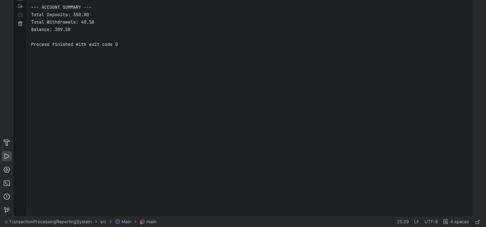
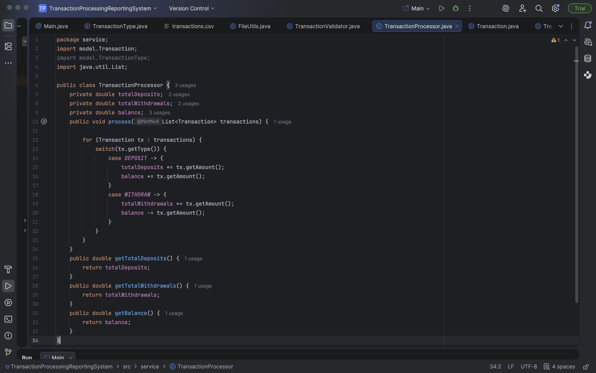
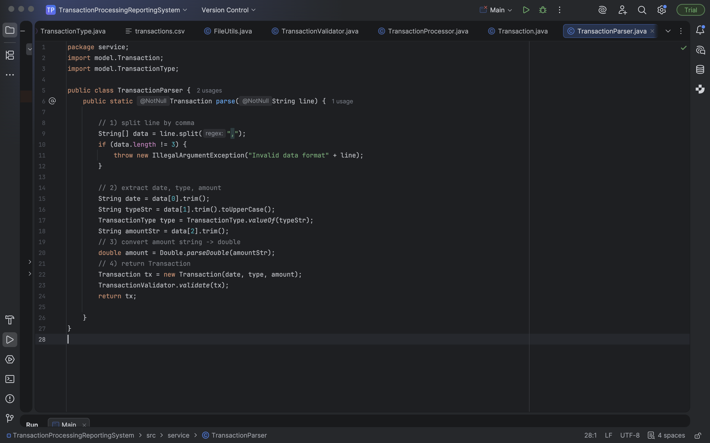
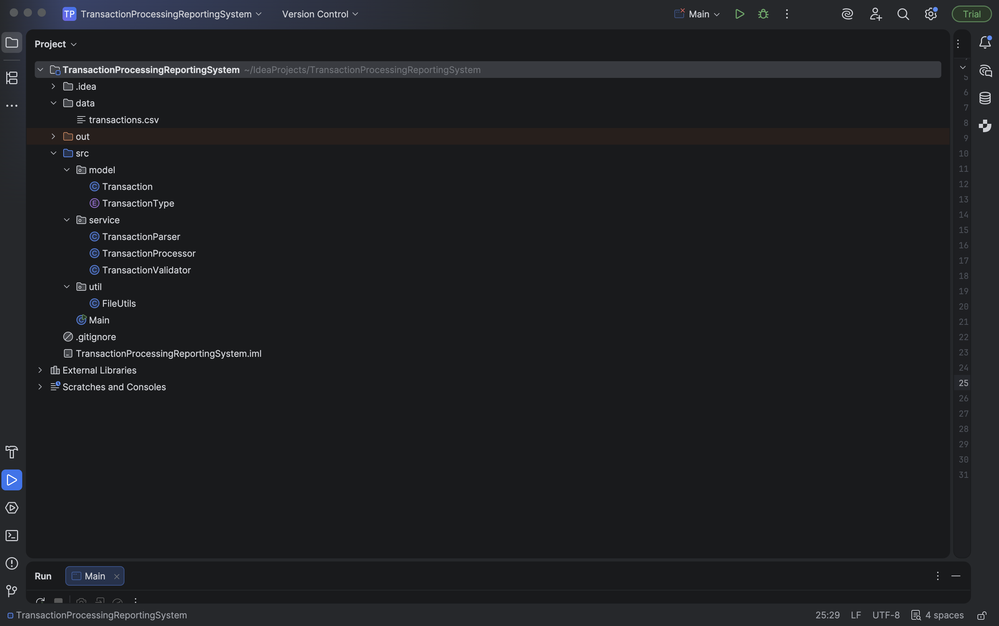

# 📊 Transaction Processing & Reporting System (Java)

## Overview
The **Transaction Processing & Reporting System** is a Java-based backend application that reads financial transaction data from a CSV file, validates inputs, applies business rules, and generates a formatted account summary report.

This project demonstrates clean architecture principles, strong domain modeling, and enterprise-style Java practices commonly used in production backend systems.

---

## Key Features
- Reads structured transaction data from an external CSV file
- Validates transactions to prevent invalid or unsafe data
- Uses enums to enforce type safety and eliminate invalid states
- Applies business logic to calculate deposits, withdrawals, and balances
- Produces a clean, formatted account summary report
- Organized using layered architecture for maintainability

---

## Technologies & Concepts
- Java
- Enums for domain modeling
- File I/O (NIO)
- Exception handling
- Input validation
- Separation of concerns
- Clean architecture (model / service / util layers)

---

## Application Output

### Account Summary Report

This output confirms:
- Correct transaction processing
- Accurate financial calculations
- Clean, readable reporting format

---

## Core Implementation Highlights

### Transaction Processing Logic

The processor applies business rules using a type-safe enum and a switch statement to:
- Accumulate total deposits
- Accumulate total withdrawals
- Maintain a running account balance

This approach prevents invalid transaction types and improves long-term maintainability.

---

### Transaction Parsing & Validation

The parser:
- Converts raw CSV input into strongly typed domain objects
- Normalizes and validates transaction types using enums
- Ensures invalid data fails fast before entering the system

Validation is handled separately to keep responsibilities clearly defined.

---

## Project Structure

src/
├── model/ // Domain models and enums
├── service/ // Parsing, validation, and processing logic
├── util/ // File utilities
data/
└── transactions.csv

yaml
Copy code

This structure mirrors real-world backend applications and supports scalability and testability.

---

## How It Works
1. The application reads transaction records from `transactions.csv`
2. Each line is parsed and validated
3. Valid transactions are processed using business rules
4. A final account summary report is generated and displayed

---

## Error Handling
- Invalid CSV formats throw clear exceptions
- Unsupported transaction types are rejected at parse time
- Invalid transaction amounts are blocked during validation
- File read failures surface meaningful runtime errors

---

## Future Enhancements
- Convert transaction dates to `LocalDate`
- Add insufficient-funds protection for withdrawals
- Add unit tests using JUnit
- Export reports to CSV or JSON
- Extend transaction types (e.g., TRANSFER)

---

## Why This Project Matters
This project demonstrates practical backend engineering skills, including:
- Defensive programming
- Domain-driven design concepts
- Clean code organization
- Enterprise-ready Java practices

It reflects the type of logic and structure used in real-world financial systems.

---

## How to Run
1. Clone the repository
2. Ensure `transactions.csv` exists in the `data` directory
3. Run `Main.java`
4. View the generated account summary in the console

---

### 👤 Author
**Ambrogio Bailey**  
Aspiring Backend / Software Developer  
GitHub: https://github.com/AmbrogioBailey
